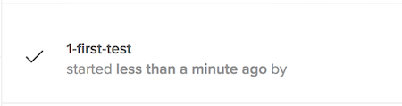

# Python Demonstration Scripts
[](https://circleci.com/gh/saucelabs-training/demo-python)

This [repository](https://github.com/saucelabs-training/demo-python) contains example scripts and dependencies for running automated Selenium tests on Sauce Labs using **Python**. You can use these scripts to test your Sauce Labs authentication credentials, setup of your automated testing environment, and try out Sauce Labs features.

> ###### Disclaimer
>
> The code in these scripts is provided on an "AS-IS" basis without warranty of any kind, either express or implied, including without limitation any implied warranties of condition, uninterrupted use, merchantability, fitness for a particular purpose, or non-infringement. These scripts are provided for educational and demonstration purposes only, and should not be used in production. Issues regarding these scripts should be submitted through GitHub. These scripts are maintained by the Technical Services team at Sauce Labs.
>
> Some examples in this repository, such as `appium-examples` and `headless-examples`, may require a different account tier beyond free trial. Please contact the [Sauce Labs Sales Team](https://saucelabs.com/contact) for support and information.

<br />

## Solution Outline
* [Tests that can help you quickly and easily get started with Sauce Labs](https://github.com/saucelabs-training/demo-python/tree/master/on-boarding-modules)
* [Tests that use the Headless feature of Sauce Labs](https://github.com/saucelabs-training/demo-python/tree/master/headless-examples) (not included with basic tier or free trial customers)
* [Mobile Examples using Appium on Sauce Labs](https://github.com/saucelabs-training/demo-python/tree/master/appium-examples/pytest-realdevices)


## Prerequisites

In order to complete these exercises you must complete the following prerequisite installation and configuration steps:

* Install Git
* Install `python` and `pip`
* Install a Test Framework
* (Optional) Install an IDE (PyCharm, Visual Studio Code, Komodo Edit etc.)

Detailed Instructions located in the [prerequisites](prerequisites.md#python-prerequisites) file.
>   #### Try Demo in Gitpod
>   Select the button below to try this demo in [Gitpod](https://www.gitpod.io/)
>
>  [](https://gitpod.io/#https://github.com/saucelabs-training/demo-python)
>
>   After the gitpod session launches, navigate to the terminal and run the following commands to save your [Sauce Labs Credentials](https://app.saucelabs.com/user-settings) to gitpod as environment variables:
>   ```
>   eval $(gp env -e SAUCE_USERNAME=******)
>   eval $(gp env -e SAUCE_ACCESS_KEY=******)
>   ```
>   Click the following link if you're unsure how to [access your Sauce Labs credentials.](https://wiki.saucelabs.com/display/DOCS/Best+Practice%3A+Use+Environment+Variables+for+Authentication+Credentials)
>   Also, if you start a new terminal in gitpod, you have to run the following command to reset envrionment variables:
>   ```
>   eval $(gp env -e)
>   ```
>  
>   For more information consult the [gitpod documentation](https://www.gitpod.io/docs/47_environment_variables/)

<br />

### Run a Sample Test

1. Navigate to the root project directory and use `pip` to install the latest Selenium library for use in the script:
    ```
    $ pip install -r requirements.txt
    ```
    
2. Run the Test Script
   > In order to run the test on [www.saucelabs.com](www.saucelabs.com), change the values of the **`SAUCE_USERNAME`** and **`SAUCE_ACCESS_KEY`** variables in the test script to your Sauce Username and Sauce Access Key values.
   > To retrieve this information, login to your saucelabs.com account and navigate to **User Settings**;
  
   * Run the following command to test your python script:
        ```
        $ python on-boarding-modules/python-examples/test_module2.py
        ```
        
   * You may also use 'Run Configurations' in your IDE. For directions on how to setup Run/Debug Configurations refer to your IDE Documentation:
        * [PyCharm Documentation](https://www.jetbrains.com/help/pycharm/creating-and-editing-run-debug-configurations.html)
        * [Visual Studio Code Documentation](https://code.visualstudio.com/docs/editor/debugging)
        * [Komodo Edit Documentation](http://docs.komodoide.com/manual)

3. Visit the [saucelabs.com automated build page](https://app.saucelabs.com/dashboard/builds) and select the build `Onboarding Sample App - Python` to see the following test case:
    
    
    
<br />
